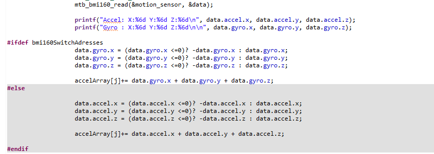
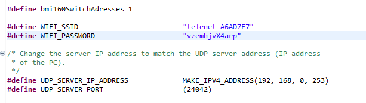

# Shake Psoc6

In this project a Psoc 6 with a CY8CKIT-028-TFT shield is used to measure the accelerometer values. the data is send and received via UDP.

when the Psoc starts it will send 'A' to the server(or any device you want to connect to the Psoc)

the server then sends a value from 1-100 wich is the time in seconds the psoc will be measuring the shaking.
After this time has passed the psoc will send the shake value in a string(asci) back to the server.

## How to use

Change WIFI_SSID and WIFI_PASSWORD to the name and password of your wifi network in udp_client.h  
   

Change UDP_SERVER_IP_ADDRESS and UDP_SERVER_PORT to the ip and port of your server in udp_client.h   
  

### Wrong sensor type
The CY8CKIT-028-TFT shield claims to have a BMI160, but in my case the register adresses of the acceleration and gyroscope data where switched arround. Like the adresses of a BMI270.  
For this i created a ifdef so in case other people do actually have the BMI160 sensor will be able to use this code 
  
if you have the BMI160 just comment out the #define bmi160SwitchAdresses 1
  
If your accelerometer values are higher then 100 while the psoc is sitting still(you are not shaking it) then you likely do have the BMI160 and you need to comment or remove the  #define bmi160SwitchAdresses 1
## Example

https://user-images.githubusercontent.com/69217508/159126515-e50976c9-af8f-44a0-b190-e4efb69d2e54.MOV

