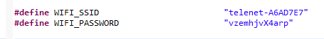
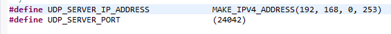
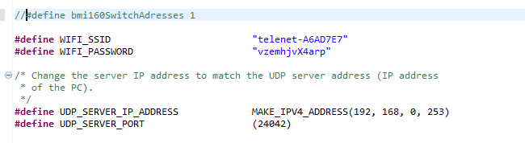
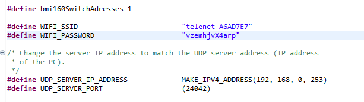

# Shake Psoc6

In this project a Psoc 6 with a CY8CKIT-028-TFT shield is used to measure the accelerometer values. The data is send and received via UDP with a Beckhoff PLC server. The psoc who is shaken the hardest will win this game.

when the Psoc starts it will send 'A' to the server(or any device you want to connect to the Psoc). when both players are connected the start button can be pressed to start the game. The PLC will then send an 'S' to the Psocs and the psocs will start measuring how much they are being shaken.
  
The PLC then cyclically sends 'B' to the psoc and the psoc will send its current shake value back. When the PLC decides the winner it will send a 'L' to the loser psoc and a 'W' to the winning psoc and the visualization from the PLC will declare the winner. The button can then be pressed in order to start another game.

Player 1 sends to port 24042  
Player 2 sends to port 24043  

## How to use
in Twincat:  
change sLocalHost to the ip of the PLC. in MAIN 

optionally: the g_nShakeWin can be changed to set the ammout of shaking that has to has happend to declare the winner. in GVL 
PS: g_nShake1 and g_nShake2 are the shake values of the Psocs. This can be used to control something like a LED array.

Change WIFI_SSID and WIFI_PASSWORD to the name and password of your wifi network in udp_client.h  
   

Change UDP_SERVER_IP_ADDRESS and UDP_SERVER_PORT to the ip and port of your server in udp_client.h   
  

### Wrong sensor type
The CY8CKIT-028-TFT shield claims to have a BMI160, but in my case the register adresses of the acceleration and gyroscope data where switched arround. Like the adresses of a BMI270.  
For this i created a ifdef so in case other people do actually have the BMI160 sensor will be able to use this code 
  
if you have the BMI160 just comment out the #define bmi160SwitchAdresses 1
  
If your accelerometer values are higher then 100 while the psoc is sitting still(you are not shaking it) then you likely do have the BMI160 and you need to comment or remove the  #define bmi160SwitchAdresses 1
## Example

https://user-images.githubusercontent.com/69217508/160462657-275ae4d2-4bfa-4ece-b2f9-e2c153e6f753.MOV

